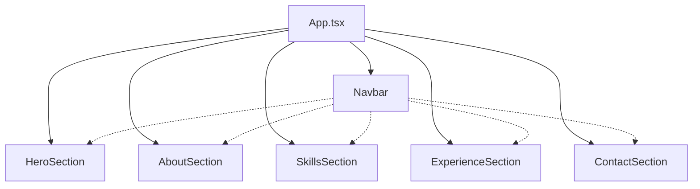

## Introduction

This portfolio application is built with modern React components using TypeScript, Framer Motion for animations, and Tailwind CSS for styling. All components follow a consistent design system with smooth scroll animations and responsive layouts.

## Architecture

The component structure is organized into main sections that compose the single-page portfolio:

<CardGroup cols={2}>
  <Card title="HeroSection" icon="star" href="/components/hero-section">
    Landing section with animated introduction and branding
  </Card>
  <Card title="AboutSection" icon="user" href="/components/about-section">
    Professional background with key statistics and achievements
  </Card>
  <Card title="SkillsSection" icon="lightbulb" href="/components/skills-section">
    Grid of expertise areas with icons and descriptions
  </Card>
  <Card title="ExperienceSection" icon="briefcase" href="/components/experience-section">
    Timeline view of professional experience and roles
  </Card>
  <Card title="ContactSection" icon="mail" href="/components/contact-section">
    Call-to-action with social links and footer
  </Card>
  <Card title="Navbar" icon="bars" href="/components/navbar">
    Sticky navigation with scroll-based styling
  </Card>
</CardGroup>

## Design System

### Color Tokens

All components use CSS custom properties for theming:

- `--hero-gradient`: Background gradient for hero section
- `--primary`: Primary brand color (blue accent)
- `--foreground`: Main text color
- `--muted-foreground`: Secondary text color
- `--border`: Border color for cards and dividers
- `--card`: Card background color

### Typography

Two font families are used throughout:

- `font-heading`: For headings and emphasis (Inter)
- Default font: For body text (system fonts)

### Spacing

Consistent section spacing:

- `py-24 md:py-32`: Standard section padding
- `container px-6`: Content container with horizontal padding
- `max-w-5xl mx-auto`: Centered content with max width

## Animation Strategy

All components leverage Framer Motion for scroll-triggered animations:

<Tabs>
  <Tab title="Initial State">
    Components start with `opacity: 0` and vertical offset `y: 20-40`
  </Tab>
  <Tab title="Animation">
    Use `whileInView` with `viewport={{ once: true }}` to trigger on scroll
  </Tab>
  <Tab title="Timing">
    Staggered delays (0.1-0.2s increments) for sequential reveals
  </Tab>
</Tabs>

### Common Animation Pattern

```tsx
<motion.div
  initial={{ opacity: 0, y: 30 }}
  whileInView={{ opacity: 1, y: 0 }}
  viewport={{ once: true }}
  transition={{ duration: 0.6 }}
>
  {/* Content */}
</motion.div>
```

## Responsive Design

All components are fully responsive:

- **Mobile-first approach**: Base styles for mobile, enhanced with `md:` and `lg:` breakpoints
- **Flexible grids**: Using `grid` with responsive columns (`md:grid-cols-2`, `lg:grid-cols-3`)
- **Text scaling**: Responsive font sizes (`text-lg md:text-xl`)
- **Navigation**: Desktop navigation hidden on mobile (could be enhanced with mobile menu)

## Component Relationships



The Navbar provides anchor links to all sections, enabling smooth scroll navigation throughout the single-page application.

## Data Management

Components use local data arrays for content:

- `stats` array in AboutSection
- `skills` array in SkillsSection
- `experiences` array in ExperienceSection
- `links` array in Navbar

This approach keeps components self-contained while allowing future migration to external data sources or CMS integration.

## Next Steps

<CardGroup cols={2}>
  <Card title="Hero Section" icon="rocket" href="/components/hero-section">
    Learn about the animated landing section
  </Card>
  <Card title="About Section" icon="info" href="/components/about-section">
    Explore the stats and background component
  </Card>
  <Card title="Skills Section" icon="code" href="/components/skills-section">
    Discover the expertise grid layout
  </Card>
  <Card title="Experience Section" icon="clock" href="/components/experience-section">
    Understand the timeline implementation
  </Card>
</CardGroup>